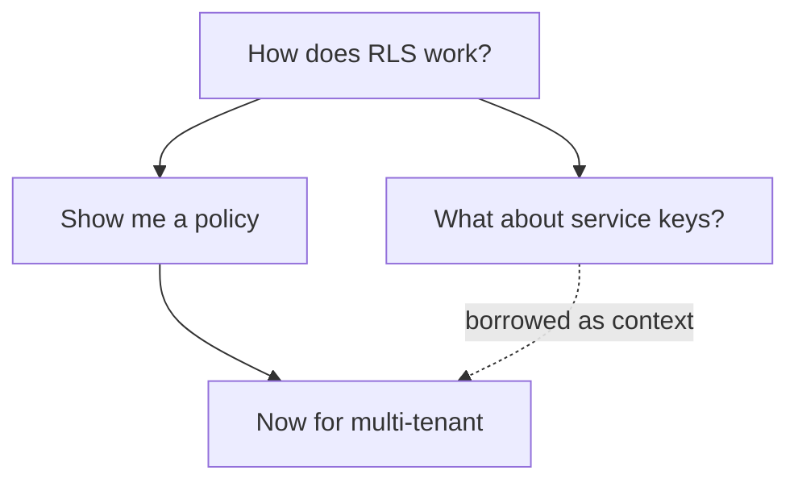

# 🫟 Splat

**Chat with an LLM on an infinite canvas instead of in a scrolling transcript.**

Every prompt/response pair is a **card**. Cards link into a directed graph. When
you write a new prompt, you pick — with checkboxes — exactly which ancestor
cards get sent as context.



That's the whole idea, and it fixes a specific thing that's wrong with chat UIs:
a linear thread makes you choose between polluting your context with a tangent
and losing the tangent entirely. On a graph you just branch. Explore three
approaches side by side, and pull context from whichever branches actually
turned out to be relevant.

**BYOK** — you connect your own OpenAI, Anthropic, or OpenRouter key. There's no
hosted tier and no server-side account with a balance. Your keys are encrypted
at rest and only ever decrypted inside a route handler.

---

## Run it locally

You'll need Node 20+, a free [Supabase](https://supabase.com) project, and an
API key from at least one provider.

```sh
git clone https://github.com/akorman128/Splat.git
cd Splat
npm install
cp .env.example .env.local
```

Fill in three required values in `.env.local`:

| Variable | Where it comes from |
| --- | --- |
| `NEXT_PUBLIC_SUPABASE_URL` | Supabase dashboard → Project Settings → API |
| `NEXT_PUBLIC_SUPABASE_ANON_KEY` | Same page — the publishable (anon) key |
| `APP_ENCRYPTION_KEY` | Generate one: `openssl rand -base64 32` |

(`.env.example` also lists three optional vars: OpenRouter attribution headers
and a tldraw license key to drop the canvas watermark. Skip them.)

Push the schema, then start:

```sh
supabase link --project-ref <project-ref>
supabase db push
npm run dev          # → http://localhost:3000
```

Sign up with email + password (auto-confirm is on, so no SMTP needed), paste a
provider key on the onboarding screen, and you're in. Google OAuth is wired up
but needs a Google Cloud client configured under *Authentication → Providers*
before that button does anything.

## How it fits together

Four invariants hold the design together. If you're changing something and one
of these gets in your way, that's worth an issue — please don't just route
around it.

**1. Supabase owns meaning, tldraw owns geometry.** A tldraw shape holds a
`nodeId` and nothing else. Every piece of real state — prompt, response, model,
edges, status — lives in Postgres. Card positions flow the other way, debounced
back into `nodes.canvas_*`. This is why a reload is cheap and why the canvas
library stays swappable.

**2. Every LLM call starts on the server.** Provider SDKs and API keys are never
imported by client code — `import "server-only"` fails the build if you try. The
client's only route to a model is `fetch` against `/api/*`.

**3. The graph can't cycle.** A recursive-CTE trigger in Postgres rejects any
context edge that would create one, and `lib/graph/cycle-check.ts` mirrors that
check client-side for a fast error. Both exist on purpose; the database is the
one that's authoritative.

**4. RLS scopes everything to `auth.uid()`.** Every table. There is no
service-role client anywhere in the app.

### Where things live

| Path | What's in it |
| --- | --- |
| `app/api/chat/` | The main event: validates the model, builds the message list, streams |
| `app/api/{credentials,models,suggestions,geometry}/` | Key management, OpenRouter catalogue, titles + chips, position writes |
| `lib/providers/` | One adapter per provider behind a 3-method interface |
| `lib/graph/` | Pure functions: ancestors, descendants, topological order, cycle check |
| `lib/store/` | zustand: composer state, graph cache, in-flight stream text |
| `components/canvas/` | tldraw shape util, card rendering, overlay, keyboard nav |
| `components/composer/` | Prompt box, provider/model picker, context checkboxes |
| `supabase/migrations/` | Schema, RLS policies, triggers |

Tables: `profiles`, `provider_creds`, `conversations`, `nodes`, `context_edges`,
`suggestions`.

## Good first contributions

There's no CONTRIBUTING.md yet and issues are sparse — so here are real,
specific things worth doing, roughly by size. Claim one by opening an issue.

**Start here**

- **Tests for `lib/graph/`.** There is currently *no* test setup at all, and
  these five files are pure functions with zero I/O — the ideal place to start
  one. Wire up Vitest, cover `topoOrder` and `validateContextSelection`, and
  you've given the project its first safety net.
- **A real tokenizer.** `lib/tokens.ts` is `text.length / 4`. The context picker
  shows those numbers to users as if they mean something. `js-tiktoken` or
  similar would make the running total honest.
- **Card resize.** `canvas_w/h` are persisted on every node and currently always
  hold the defaults — resizing was disabled outright. The plumbing is already
  there.

**Meatier**

- **Add a provider.** `ProviderAdapter` in `lib/providers/types.ts` is three
  methods: `verifyKey`, `streamChat`, `generateFollowups`. A generic
  OpenAI-compatible adapter (Ollama, LM Studio, vLLM, any base URL) would let
  people run Splat fully local. Note the `provider` check constraint in the
  schema needs a migration too — see
  `20260726000004_openrouter_provider.sql` for the pattern.
- **Export a conversation.** Walk the graph with `lib/graph/topo-order.ts` and
  emit Markdown. Obvious feature, self-contained, no new concepts.
- **Search across cards.** Postgres full-text over `nodes.prompt/response`,
  scoped by RLS, with results that pan the camera to the hit.
- **Re-parent a card, or edit its context after the fact.** Right now a card's
  context set is frozen at creation. The cycle-check trigger already guards the
  write, so the hard part is the interaction design, not the data model.

**Ambitious**

- **Mobile.** The canvas is desktop-only today. `hooks/use-mobile.ts` and the
  sidebar already respond; the canvas and composer don't.
- **Multiplayer.** tldraw has the primitives and Supabase has realtime. Nobody
  has tried.

Bug reports and "this confused me" issues are genuinely useful too — much of the
UI has been exercised by roughly one person.

## Model configuration

`lib/providers/models.ts` is the **only** place model ids live, as a
`role → model id` map:

| Provider | Conversation model | Utility model |
| --- | --- | --- |
| OpenAI | `gpt-5.6-sol` | `gpt-5.6-luna` |
| Anthropic | `claude-opus-5` | `claude-haiku-4-5` |
| OpenRouter | any catalogue id (default `openrouter/auto`) | `google/gemini-2.5-flash-lite` |

The composer's first dropdown picks a **provider**, not a model. OpenAI and
Anthropic each expose exactly one conversation model — the pinned id above — and
`/api/chat` rejects anything else. OpenRouter is the exception: it's a
*catalogue* provider (`CATALOG_PROVIDERS`), so a second picker appears listing
the live catalogue from `/api/models`, and any id it currently serves is
accepted.

Two behaviours worth knowing before you touch this code:

- **Validation fails open.** If the catalogue is unreachable, any plausibly
  shaped `vendor/model` id is let through rather than blocking a send on our own
  outage.
- **`max_tokens` is computed, not fixed.** The adapter sizes it from the
  catalogue's context window, the declared output ceiling, *and* the estimated
  prompt size — a declared output cap doesn't exempt a model from its context
  window. Where the catalogue declares neither (including `openrouter/auto`,
  whose numbers are the union across everything it might route to) the request
  goes out with no `max_tokens` and OpenRouter applies the model's default.

The **utility model** handles one structured call — "title + exactly 3
suggestions", strict JSON schema, small output budget — and is fixed per
provider regardless of the conversation model. If it's unavailable on an
account the adapter falls back one tier up and logs it.

## Gotchas

Things that cost real debugging time. Worth reading before you file a bug
against them.

- **tldraw v5 drifted from its docs.** Shape props register via TypeScript
  module augmentation (`TLGlobalShapePropsMap`), indicators are
  `getIndicatorPath(): Path2D`, and `editor.store.listen` never delivered
  entries in this build — geometry persistence uses
  `editor.sideEffects.registerAfterChangeHandler("shape", …)` instead.
- **Next 16 renamed `middleware.ts` → `proxy.ts`** (exported function `proxy`).
  The Supabase session-refresh middleware lives there. This repo tracks Next 16
  closely and its APIs differ from older tutorials — see `CLAUDE.md`.
- **Utility calls send no temperature.** Current reasoning models on both
  providers reject non-default sampling params. Determinism comes from strict
  JSON schemas and low output budgets instead.
- **Edges are read-only by construction.** The tldraw UI is hidden (`hideUi`,
  which also kills tool keyboard shortcuts), so the arrow tool is unreachable.
  Arrows are created programmatically, locked, and a before-delete side effect
  vetoes deleting any shape.
- **Streaming text never touches the tldraw store.** It lives in a client store
  (`lib/store/stream-store.ts`) and the server flushes partials to Supabase every
  ~2s / 500 chars. Kill the dev server mid-stream and reload: the partial
  survives with an "interrupted" notice and a Retry button. Retry is always a
  fresh attempt, never a splice.
- **Suggestions are generated once, eagerly.** If that utility call fails, the
  card just has no chips — there's no retry-on-reload sweep. (Fixing this is a
  fine first contribution.)

## Sending a pull request

There's no CI yet, so please run both locally — a PR that adds CI would be very
welcome:

```sh
npx tsc --noEmit
npm run lint
```

Then click through whatever you touched. The paths most likely to break:
streaming into a card, dragging a card and reloading to confirm the position
stuck, clicking a suggestion chip to spawn a child, and unchecking an ancestor
in the context picker (non-parent sources render as **dashed** arrows, the
parent edge stays solid).

If your change goes anywhere near provider code, confirm nothing leaked into the
client bundle:

```sh
npm run build
grep -rE "api\.openai\.com|api\.anthropic\.com|sk-ant-|sk-proj-" .next/static/
```

That should return nothing.

House style: no comments unless the code genuinely can't explain itself. Match
what's around you.

## License

⚠️ **This repo does not have a license file yet**, which technically means
default copyright — you can read the code but you can't safely fork or ship it.
This is being sorted out; until it is, treat anything you contribute as
contingent on the license that lands.
